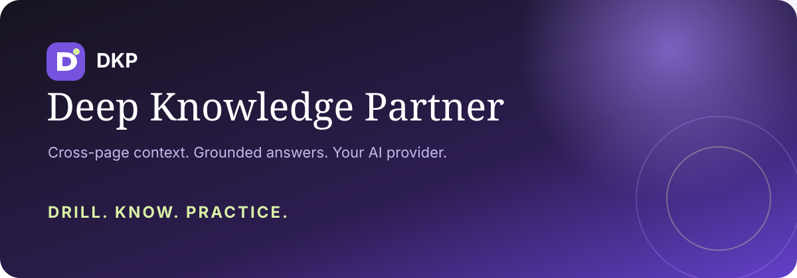

  

# DKP — Deep Knowledge Partner

**Drill. Know. Practice.**

DKP is a Firefox study companion that understands readings and exercises as separate entities, connects related pages into reusable knowledge contexts, and generates answers with evidence you can open in the original source.

> Beta 0.2.0 is a temporary-install developer release. Generated answers can be wrong. DKP fills supported controls but never submits coursework.

## What the beta includes

- **Cross-page contexts.** Add readings and exercises to one context, then answer a task using relevant material from other pages.
- **Semantic page mapping.** The selected AI provider separates topics, real questions, native quiz blocks and incomplete references. Article headings such as “What is lifelong learning?” are not automatically treated as exercises.
- **Topics and quizzes stay separate.** Summary and translation actions belong to reading regions; answer and solve actions belong to genuine tasks.
- **Solve all tasks.** One full-width action handles every detected task, fills supported empty controls and leaves submission to you.
- **Grounded explanations.** Why this answer can include verified source excerpts. Click an excerpt to open the source page and highlight it for five seconds.
- **Four AI providers.** Connect Google Gemini, OpenAI, Anthropic Claude or DeepSeek with your own API key, then select a model returned by that provider.
- **Native-language support.** Explanations, summaries and translations default to Russian. Form-ready answers remain in the exercise language.
- **Complex-task strategy.** DKP returns a structured long answer when evidence is sufficient, or explains the solution process and missing assumptions.
- **Precise missing-media warnings.** A warning appears only when the particular task requires an unavailable video, audio file or document.
- **Detailed errors.** Provider, endpoint, status and sanitized response details appear on screen. API keys are redacted.
- **DevTools LLM chat.** Open DevTools inside a context to inspect raw prompts, source blocks, schemas, provider responses and errors. Logs stay local and credentials are redacted.

## Temporary installation in Firefox

Requirements:

- Firefox Desktop 142 or newer
- Node.js 22 or newer
- npm

Clone and build:

    git clone https://github.com/kmokou/DKP.git
    cd DKP
    npm ci
    npm run build

Load the extension:

1. Open Firefox.
2. Go to **about:debugging#/runtime/this-firefox**.
3. Click **Load Temporary Add-on…**
4. Select **dist/manifest.json**.
5. Open a lesson, article or exercise in a normal web tab.
6. Click the DKP toolbar icon and add the page to a context.

Firefox removes a temporary extension when the browser closes. Repeat steps 2–4 after restarting Firefox. A signed AMO release is planned after the beta stabilizes.

## First run

1. Open **Settings**.
2. Choose an AI provider.
3. Paste that provider's API key.
4. Decide whether Firefox should remember it locally.
5. Click **Save & load models**.
6. Choose a model from the returned list and save preferences.
7. Open the context to ask questions across its pages.

DKP uses the provider account, quota and billing attached to your API key. It does not include an API subscription.

## Working with contexts

A context is a group of pages that belong to the same course unit, topic or exam.

    English · Unit 1.6
    ├── Lifelong learning article
    ├── Vocabulary page
    ├── Reading questions
    └── Matching exercise

When you solve the matching exercise, DKP retrieves relevant excerpts from the article and vocabulary page before asking the selected model. It does not send every stored page with every request.

Each context stores up to 12 compact page snapshots locally. You can remove one page or delete the entire context from the **Contexts** tab.

The context workspace also includes **DevTools**, a chronological raw LLM conversation for debugging. It records the exact system and user payloads sent by DKP, retrieval material, schemas, provider metadata and the unmodified response or error. API keys and authorization headers are never recorded.

## Page actions

| Action | When it appears | Behavior |
| --- | --- | --- |
| Summarize text | A reading region exists | Produces study notes without solving exercises |
| Translate | A reading region exists | Translates into the configured native language |
| Answer questions | Genuine prose questions exist | Answers question groups without treating headings as tasks |
| Solve tasks | Native or complex exercises exist | Produces structured answers and field mappings |
| Solve all tasks | At least one task exists | Solves all detected tasks and fills supported empty fields |
| Ask across context | After a page is in a context | Retrieves evidence from every related stored page |

DKP supports standard text inputs, number inputs, textareas, radio buttons, checkboxes and native select elements. Rich-text editors, drag-and-drop exercises, canvas activities and custom H5P components remain best-effort.

## Evidence navigation

Provider output cannot create arbitrary source links. DKP verifies that every evidence quote exists in an extracted source block before rendering it.

An evidence card contains the exact verified quote, blurred surrounding text, the source page title, and a link back to the original passage. Clicking it activates or opens the source page, scrolls to the matching block, highlights it, and fades the highlight after five seconds.

## Privacy

- There is no DKP backend, account, analytics SDK, advertising system or shared answer database.
- A generation action sends relevant website content directly to the provider selected in Settings.
- Contexts and settings remain in Firefox extension storage on this device.
- Keys use session storage by default. **Remember on this device** stores a key in the local Firefox extension profile, which is not an encrypted vault.
- DKP does not deliberately collect passwords, cookies, LMS session tokens or existing form drafts.
- DKP never clicks Submit, Check, Finish or Next.

Read the complete in-extension privacy note in [public/privacy.html](public/privacy.html).

## Development

    npm ci
    npm run typecheck
    npm test
    npm run build
    npm run lint:extension
    npm run test:browser

Run a temporary Firefox profile:

    npm run dev

Create an unsigned ZIP:

    npm run package

Generated **dist**, **artifacts** and **node_modules** directories are intentionally excluded from Git.

## Architecture

    src/
    ├── providers/          Gemini, OpenAI, Claude and DeepSeek adapters
    ├── background.ts       trusted requests, keys, contexts, retrieval and navigation
    ├── context.ts          compact page storage and cross-page retrieval
    ├── extract.ts          deterministic DOM extraction and stable control IDs
    ├── content.ts          semantic controls, answer cards, form filling and highlights
    ├── core.ts             prompts, schemas and evidence validation
    ├── sidebar.ts          workspace, contexts, provider settings and results
    └── types.ts            domain model

The extraction layer gives the model a bounded map of stable block IDs. The model proposes semantic units, and local code rejects unknown IDs and unsafe placement. Generated evidence is also verified locally before it becomes clickable.

## Current beta limits

- Context knowledge is local to one Firefox profile and does not sync.
- PDFs, embedded documents, video and audio are not automatically opened.
- Semantic mapping requires a configured provider; without one, DKP falls back to conservative native-task and reading detection.
- AI model availability and structured-output behavior differ by provider.
- Provider APIs can charge for requests.
- Site-specific LMS widgets may need dedicated adapters.
- This repository currently ships an unsigned temporary-install build.

## Security

Do not commit API keys. If a key is exposed, revoke it with the provider immediately. Security reports can be opened through GitHub Issues without including credentials or private course material.

## License

MIT — see [LICENSE](LICENSE).
